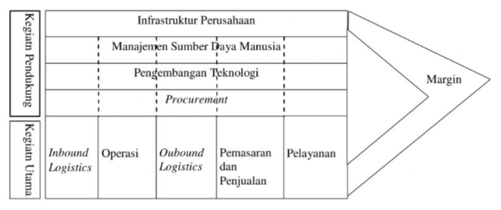
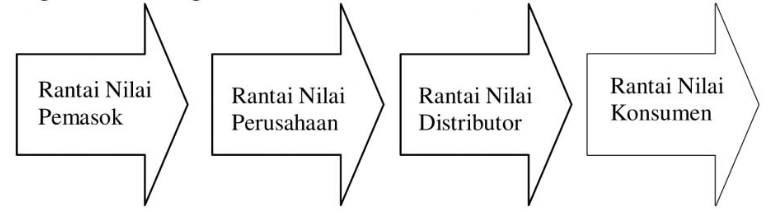
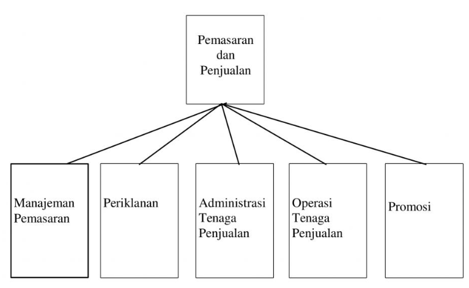

Nama : Fitrah Ali Hudzaifah Sofyan

NIM : xxxxxx

---

## Jelaskan bagan manajemen rantai Nilai !

---

Manajemen rantai nilai membicarakan pengelolaan proses penciptaan nilai untuk konsumen.

Berikut ini adalah bagan rantai nilai yang diperkenalkan oleh Michael Porter pada tahun 1985

Bagan tersebut berfokus pada sistem, dan bagaimana input diubah menjadi output yang dibeli oleh konsumen. Menggunakan sudut pandang ini, Porter menggambarkan rantai kegiatan umum untuk semua bisnis, dan ia membagi mereka ke dalam kegiatan utama dan kegiatan pendukung.

Rantai nilai tersebut terdiri atas kegiatan pendukung: 

- Infrastruktur Perusahaan
    
    Sistem dukungan perusahaan, dan fungsi-fungsi yang memungkinkan untuk mempertahankan operasi sehari-hari seperti akuntansi, hukum, administrasi, dan manajemen.

- Manajemen Sumber Daya Manusia
  
    Seberapa baik sebuah perusahaan merekrut, melatih, memotivasi, memberi penghargaan, dan mempertahankan para pekerjanya.

- Pengembangan Teknologi

    Kegiatan ini berhubungan dengan pengelolaan dan pengolahan informasi, serta melindungi basis pengetahuan perusahaan.

- *Procurement* (pengadaan)

   Kegiatan organisasi untuk mendapatkan sumber daya yang dibutuhkan untuk beroperasi.
  
Kemudian, rantai nilai mempunyai kegiatan utama, yaitu :
- *Inbound Logistics*
  
    Semua proses yang terkait dengan menerima, menyimpan, dan mendistribusikan input internal.

- Operasi
  
  Kegiatan transformasi yang mengubah input menjadi output yang akan dijual kepada pelanggan.

- *Outbound Logistics*
  
    Kegiatan ini memberikan produk atau layanan kepada pelanggan.

- Pemasaran dan Penjualan
  
    Proses yang digunakan untuk membujuk pelanggan untuk membeli produk yang dijual.

- Pelayanan
    
    Kegiatan yang bertujuan untuk meningkatkan dan menjaga nilai produk.

Kegiatan pendukung dan utama tersebut ditujukan untuk menciptakan nilai, yaitu manfaat yang dihargai oleh konsumen. 

Dari sudut pandang konsumen, jika nilai atau manfaat yang ditawarkan sepadan dengan harganya, konsumen bersedia membeli.

Dari sudut pandang perusahaan, jika harga yang dibayarkan konsumen diatas biaya yang dikeluarkan oleh perusahaan untuk memproduksi manfaat atau produk tersebut, perusahaan bisa menghasilkan nilai tambah. Selisih antara harga jual dan biaya yang dikeluarkan disebut juga sebagai margin.

Garis patah patah menunjukkan bahwa kegiatan manajemen sumber daya manusia, pengembangan teknologi, dan *procurement* bisa bersinggungan dengan masing-masing kegiatan utama. 

Garis patah patah berhenti pada kegiatan infrastruktur perusahaan, karena infrastruktur perusahaan melayani semua kegiatan utama perusahaan. Kegiatan infrastruktur perusahaan tidak melayani kegiatan utama secara terpisah.

Rantai nilai perusahaan tersebut jika dilihat dengan perspektif yang lebih luas, merupakan bagian dari rantai nilai industri atau sektor usaha yang melingkupi perusahaan tersebut. Rantai nilai indistri tersebut digambarkan sebagai berikut :

Bagan tersebut menunjukkan bahwa rantai nilai perusahaan merupakan bagain dari rantau nilai-nilai yang lain, yang kemudian membentuk nilai industri.

Kegiatan perusahaan dalam rantai nilai bisa dipecah-pecah dalam beberapa aktivitas yang berada di dalamnya. Sebagai contoh, kegiatan pemasaran dan penjualan bisa dipecah  dalam keguatan-kegiatan di dalamnya, seperti terlihat dari bagan berikut ini.

Meskipun bentuk generik rantai nilai akan sama untuk semua perusahaan, rantai nilai untuk setiap perusahaan akan berbeda satu sama lain.

Kegiatan utama dalam rantai nilai akan ada untuk semua rantai nilai. tetapi dengan tingkatan yang berbeda0beda. Tingkatan yang berbeda tersebut yang memunculkan ciri-ciri yang berbeda antara rantai nilai satu perusahaan dengan nilai perusahaan lainnya.

---

## Jelaskan kegiatan pendukung rantai Nilai !
---

Kegiatan pendukung mendukung fungsi kegiatan utama pada rantai nilai. Dalam diagram kita, garis putus-putus menunjukkan bahwa setiap dukungan, atau sekunder, aktivitas dapat berperan dalam setiap kegiatan utama. Misalnya, pengadaan mendukung operasi dengan kegiatan tertentu, tetapi juga mendukung pemasaran dan penjualan dengan kegiatan lain.

- Procurement (pengadaan) 
  
  Kegiatan organisasi untuk mendapatkan sumber daya yang dibutuhkan untuk beroperasi.

- Manajemen Sumber Daya Manusia 
  
  Seberapa baik sebuah perusahaan merekrut, melatih, memotivasi, memberi penghargaan, dan mempertahankan para pekerjanya.
  
  Kegiatan ini mencakup aktivitas yang berkaitan dengan karyawan perusahaan, seperti rekrutmen, pengembangan, dan pemberian kompensasi.
- Pengembangan Teknologi 
  
  Kegiatan ini berhubungan dengan pengelolaan dan pengolahan informasi, serta melindungi basis pengetahuan perusahaan.

- Infrastruktur Perusahaan 
  
  Sistem dukungan perusahaan, dan fungsi-fungsi yang memungkinkan untuk mempertahankan operasi sehari-hari seperti akuntansi, hukum, administrasi, dan manajemen. 
  
  Infrastruktur perusahaa mencakup prasarana yang digunakan perusahaan untuk menjalankan akivitasnya.
---

Sumber : 

BMP EKMA4116/MODUL halaman 11.5 – 11.8

https://sis.binus.ac.id/2017/04/20/value-chain-analysis/
